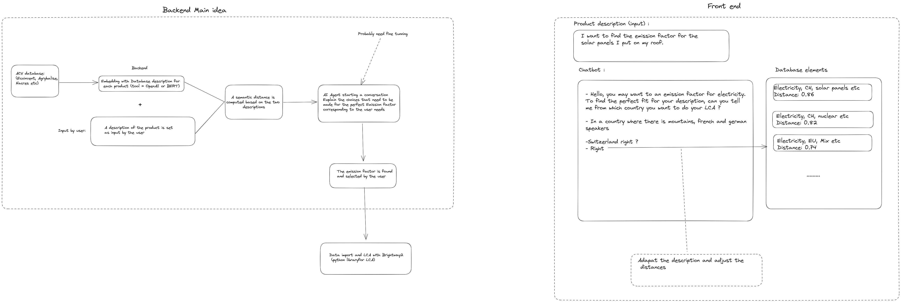

# LCA_LLM

## Description
The idea is to create a Chatbot for an easy and comprehensible LCA analysis.

## Steps:
1. Import Ecoinvent/Agribalyse etc databases
2. Create a database with all the LCA definitions and keywords so the chatbot can understand it and reformulate it in a simple way
3. Vectorize the ecoinvent database
4. Try to use as entry a text, and use a first iteration of chatgpt in order to tranform the text into a technical LCA keywords
5. Use the vectorized database to find the closest LCA definition to the keywords
6. Create an interactive chatbot that can ask questions to the user to refine the process 
7. Create a web interface

